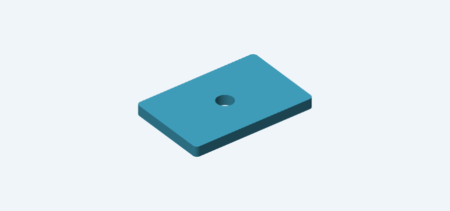
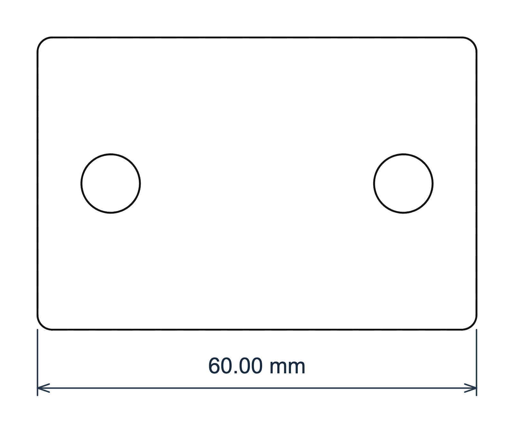
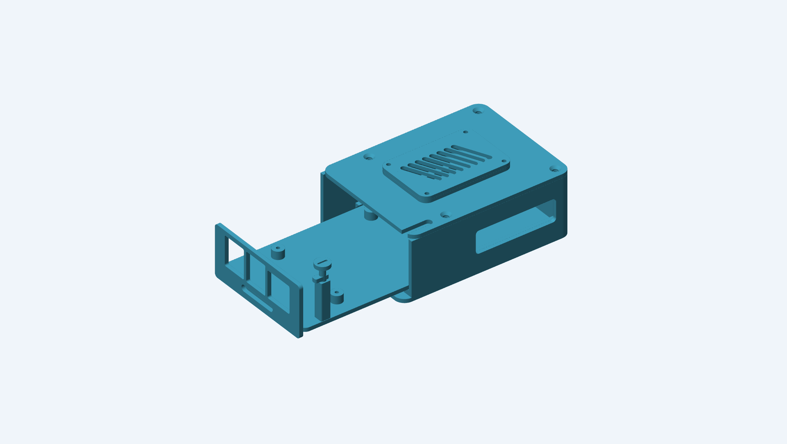
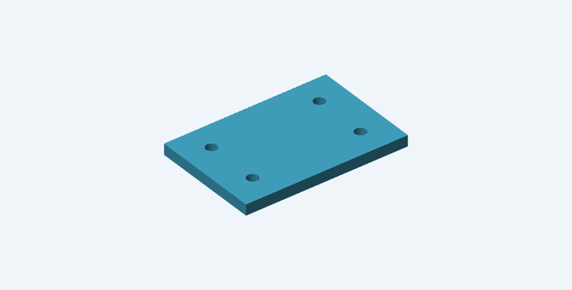
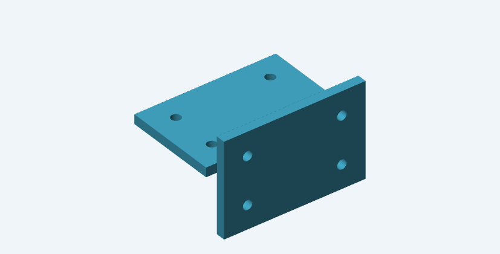

# Smith

Smith is an Elixir CAD library. Build sketches, solids, and named assemblies with functions and pipelines, then export STEP, STL, and 3MF files. Models run in a standalone `.exs` script, a Livebook, or an existing Mix application.

Smith uses [OCEx](https://hexdocs.pm/ocex). The geometry engine is Open CASCADE Technology (OCCT) 7.9.3.

New to CAD? Start with [CAD concepts](guides/cad-basics.md) and
[getting started](guides/getting-started.md). The [Livebook catalog](guides/livebook.md#choose-a-lesson)
orders the lessons from a single plate through assemblies and complete projects.
Guides explain the API and its limits; notebooks let you change a model and inspect
each stage.

## A printable part in one script

Install the native toolkit using the [installation guide](https://hexdocs.pm/ocex/installation.html), then save this as `mount.exs`:

```elixir
Mix.install([{:smith, "~> 0.3.0"}])
alias Smith.Sketch

model =
  Sketch.rounded_rectangle(60, 40, 2)
  |> Sketch.cut([
    Sketch.circle(4, at: {-20, 0}),
    Sketch.circle(4, at: {20, 0})
  ])
  |> Smith.extrude(5)

{:ok, result} = Smith.evaluate(model)
{:ok, files} = Smith.export(result, "output", name: "mount", on_bed: true)
IO.puts(files.three_mf)
```

<div class="smith-doc-preview" data-preview="mount" data-model="result" data-label="Mounting plate">
<p></p>
</div>

Run `elixir mount.exs`. The output bundle includes STEP, BREP, binary STL, and 3MF files, plus a report of the mesh and STEP checks. Every export gets a new directory; earlier exports remain available. 3MF contains printable geometry, without printer or slicer settings.

In an existing Mix project, add `{:smith, "~> 0.3.0"}` to `deps/0`. Smith requires Elixir 1.18+ and a supported native installation; see the installation guide for the tested OS/OTP combinations. No display server is required to model, mesh, or export.

The [HexDocs version of this README](https://hexdocs.pm/smith/readme.html) includes interactive previews below the examples. Drag to rotate, scroll to zoom, or open a preview fullscreen. GitHub shows still images.

## Font-backed lettering

Smith 0.3 adds explicit TTF/OTF font snapshots, shaped text outlines, raised or
engraved lettering, and proportional name fitting. Text reports measure actual
ink bounds and glyph placement, record the font hash, and produce matching PNG
and outline SVG previews. Follow [Text and fonts](guides/text.md)
to build and inspect a personalized keychain. Native installation now also needs
FreeType, HarfBuzz and pkg-config.

## Model inspection

Smith 0.2 includes geometry-derived measurements, named inspection reports,
headless PNG views, and measured SVG dimensions. Reports work in plain Elixir
scripts and let coding agents read measurements and check results without vision or
Livebook. Kino adds standard views, edges, clipping, and colored modeling stages.

```elixir
{:ok, width} = Smith.Measure.extent(result, :x)
{:ok, inspection} = Smith.Inspection.run(%{mount: result}, checks: [
  {:measurement, :mount, width, expected: 60, tolerance: 1.0e-6}
])
:passed = inspection.status
{:ok, drawing} = Smith.Drawing.new(result, on: :xy)
{:ok, drawing} = Smith.Drawing.dimension(drawing, width, orientation: :horizontal, offset: -8)
{:ok, svg} = Smith.Drawing.svg(drawing, title: "Measured mounting plate")
```

<div class="smith-doc-preview" data-preview="readme-measured-mount" data-model="svg" data-label="Measured mounting plate">
<p></p>
</div>

Read the [inspection guide](guides/inspection.md) for structured checks, stage
comparisons, and revision-linked image reports. The [agent guide](guides/agent-modeling.md)
explains the script workflow. ExDoc publishes [llms.txt](https://hexdocs.pm/smith/llms.txt)
and Markdown API pages; the package also includes an optional
[Smith CAD skill](skills/smith-cad/SKILL.md).

## Build a Raspberry Pi enclosure

[Follow the complete modeling walkthrough](examples/raspberry-pi-enclosure.livemd):
a sliding board tray, quarter-turn latch, curved cooling duct, and replaceable grilles.
Each stage has a rotatable preview. The lesson covers reference geometry, sketches,
lofts, shelling, nested assemblies, joints, clearance checks, and verified print files.
It also includes rail coupons to test before printing the enclosure.

[](examples/raspberry-pi-enclosure.livemd)

## Advanced study: phone fit dummy

[Model an iPhone 17 Pro fit dummy](examples/iphone-17-pro.livemd) walks through
Bézier corner profiles, an edge-roll loft, cameras, buttons, and connector
locations. Build the complete device first, then derive two printable halves
and alignment dowels. The notebook distinguishes drawing dimensions from
assumptions and checks both geometry and exports. It uses the 0.2 API. The camera plateau is an adjustable approximation, and inspection has
identified an edge-roll loft defect documented in the notebook. The model is
not yet an exact fit reference.


## Modeling with functions

Recipes are immutable values. Construction makes no native calls; `Smith.evaluate/1` builds the geometry. Reuse a sketch or body in multiple variants, name features with functions, and use ordinary comprehensions for repeated features:

```elixir
hole_pattern = for x <- [-20, 20], y <- [-10, 10], do: Sketch.circle(2, at: {x, y})

plate =
  Sketch.rectangle(60, 40)
  |> Sketch.cut(hole_pattern)
  |> Smith.extrude(4)

side_plate = plate |> Smith.rotate({1, 0, 0}, 90) |> Smith.translate({0, 30, 0})
```

<div class="smith-doc-preview" data-preview="readme-1-plate" data-model="plate" data-label="Plate">
<p></p>
</div>

<div class="smith-doc-preview" data-preview="readme-1-side-plate" data-model="side_plate" data-label="Rotated plate">
<p></p>
</div>

Distances are millimeters. Model transformations use world coordinates; sketch coordinates use a local plane. Shapes retain analytic surfaces until meshing. A recipe is your editable design; an evaluated BREP hash identifies its geometry, not its feature history.

Boxes, cylinders, cones, spheres, and tori accept `at: {x, y, z}` and per-axis alignment. For example, `Smith.box(40, 20, 4, align: {:center, :center, :min})` centers the footprint with its bottom at Z=0. See [primitive placement](guides/modeling.md).

## Assemblies

```elixir
alias Smith.Assembly

assembly =
  Assembly.new(:bracket)
  |> Assembly.part(:base, plate, print: [on_bed: true])
  |> Assembly.part(:side, side_plate, print: [rotation: {{1, 0, 0}, -90}, on_bed: true])
  |> Assembly.reference(:electronics, Smith.box(20, 10, 6), position: {-10, -5, 4})

{:ok, result} = Smith.evaluate(assembly)
{:ok, files} = Smith.export(result, "output", name: "bracket")
IO.puts(files.print_pack)
```

<div class="smith-doc-preview" data-preview="readme-2-result" data-model="result" data-label="Bracket assembly">
<p></p>
</div>

Named parts have installed, print, and display placement. Reuse groups with `Assembly.subassembly/4` and retrieve a descendant with a path such as `Assembly.fetch(result, [:left, :base])`. References stay out of printable files. A complete assembly export contains separate part bundles, assembly STEP, reference STEP, and a ZIP of printable STL/3MF pairs. The current manifest is updated after the part mesh checks and STEP round trips pass. See [exporting](guides/exporting.md) for the exact checks and their limits.

## Livebook

The [Livebook guide](guides/livebook.md) shows each construction stage in its own rotatable preview and lets you download PNG images. Kino is optional: add it to the notebook's dependencies to enable `Smith.Kino`. Modeling and export remain independent of the notebook.

The [drawing Livebook](examples/drawings.livemd)
builds a counterbored plate, compares top/front/oblique views, and exports SVG/DXF
alongside printable geometry.

## Guides

- [Getting started](guides/getting-started.md): scripts, projects, parameters, and the first export.
- [Modeling](guides/modeling.md): primitives, composition, transformations, selectors, and finishing.
- [Sketches and planes](guides/sketches.md): alignment, cutouts, fillets, extrusion, revolve, and loft.
- [Extrusion extent and taper](guides/extrusion.md): symmetric depth, tapered walls and holes, and tilted end caps.
- [Curve projection](guides/projection.md): project onto surfaces, inspect multiple hits, and fill planar outlines.
- [Orthographic drawings](guides/drawings.md): visible and hidden edges, view coordinates, and SVG/DXF export.
- [Mechanical parts](guides/mechanical-parts.md): slots, recessed holes, mirrors, and measured selections.
- [Paths, lofts, and shells](guides/paths-and-shells.md): selectors, curved sweeps, smooth transitions, and hollow parts.
- [Forming and cutting](guides/forming.md): draft, plane cuts, sections, surface offset, and thickening.
- [Assemblies](guides/assemblies.md): named parts, nested instances, references, and print placement.
- [Joints and poses](guides/joints.md): attachment frames, motion limits, and connected instances.
- [Exporting](guides/exporting.md): formats, mesh settings, verification, and output manifests.
- [Livebook](guides/livebook.md): visible build stages and downloadable images.
- [Errors and limits](guides/errors-and-limits.md): evaluation failures, native execution, and supported scope.

## Scope

Smith covers explicit dimensions, Boolean operations, edge and face selection, edge finishing, extrusion, revolution, ruled and smooth lofts, open-path sweeps, shelling with selected openings, draft, planar splits and sections, surface offset, and thickening. Sketches support lines, arcs, interpolated splines, Bézier curves, and cutouts. Version 0.2 adds geometric measurements, structured inspection reports, headless images, and dimensioned SVG drawings.

There is no sketch constraint solver, persistent topology naming, closed-linkage solver, or STEP product tree. Assembly joints provide directed rigid placement with explicit motion coordinates. Surface offsets follow 3D normals; planar sketch-outline offsets are not implemented. Thickening requires an open surface. Sketch subtraction retains one connected region. Loft and sweep sections cannot contain holes; sweep profiles must be placed explicitly. Shelling requires an opening.

OCEx serializes native operations on dirty CPU schedulers. Kernel calls are synchronous and cannot be forcibly cancelled; a native memory fault can terminate the BEAM. These limits are explained in the error guide. Export checks include mesh connectivity and volume agreement. They do not check design clearances, wall thickness, or printer settings.

Source is MIT licensed. OCCT is a separately installed dependency with its own license. See [the repository](https://github.com/ntodd/smith) for development, CI, release instructions, and the full deck clip and plant stand examples.

## Working on Smith

This is a standalone repository. See [development](https://github.com/ntodd/smith/blob/main/docs/development.md) for
local checks and [releasing](https://github.com/ntodd/smith/blob/main/docs/releasing.md) for this package's release steps.
