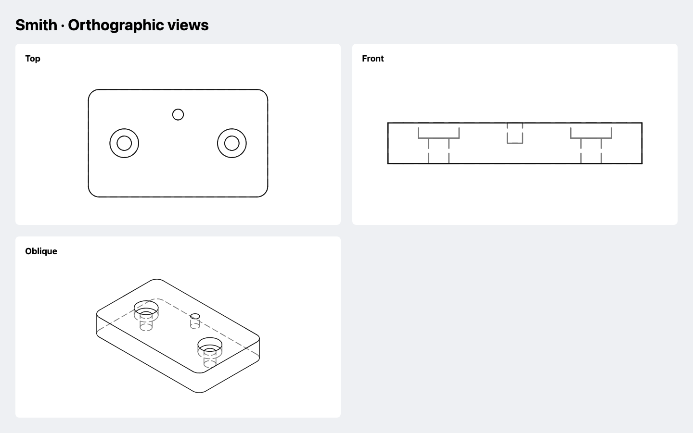

# Orthographic drawings

Use a drawing to inspect a part's outline, see hidden features, or exchange a
2D view with another application. Smith computes line visibility from the native
BREP. The result keeps curves, independently of the triangles in a 3D preview.



## Choose a view

Create the part and evaluate it once. Drawings from the result reuse that geometry.

```elixir
alias Smith.{Drawing, Plane, Sketch}

plate = Sketch.rounded_rectangle(50, 30, 3)
  |> Smith.extrude(8)
  |> Smith.counterbore(on: Plane.xy(z: 8), at: {-15, 0},
    diameter: 4, bore_diameter: 8, bore_depth: 3, through: :all)
{:ok, part} = Smith.evaluate(plate)
{:ok, top} = Drawing.new(part, on: :xy)
{:ok, front} = Drawing.new(part, on: :xz)
```

The normal points toward the viewer; the viewing direction is its negative.
Plane-local X points right and plane-local Y points up.

| Plane | Look along | Drawing X | Drawing Y |
| --- | --- | --- | --- |
| `:xy` | −Z | +X | +Y |
| `:xz` | +Y | +X | +Z |
| `:yz` | −X | +Y | +Z |

A custom plane defines an oblique orthographic view. Moving its origin in the
plane changes the drawing's coordinate origin. Moving it along the normal does
not change the image size or coordinates. There is no perspective scaling.

```elixir
view = Plane.new(normal: {1, -1, 1}, x_direction: {1, 1, 0})
{:ok, oblique} = Drawing.new(part, on: view)
{:ok, shifted} = Drawing.new(part, on: Plane.xy(origin: {10, 5, 100}))
```

Sharp boundaries and silhouettes are included. `tangents: true` additionally
includes smooth G1 boundaries between faces, which can help explain fillets.
Surface seams and isoparametric lines are omitted.

## Inspect and sample

`drawing.visible` and `drawing.hidden` are native edge collections in view-local
XY at Z=0. They support OCEx queries and BREP serialization. The drawing records
the input's `source_revision`; treat its fields as read-only.

```elixir
{:ok, visible_edges} = OCEx.edges(top.visible)
true = visible_edges != []
{:ok, lines} = Drawing.polylines(front, tolerance: 0.01, angular_tolerance: 0.1)
true = lines.hidden != []
```

Each returned polyline represents one edge. Closed edges repeat their endpoint.
Edges are not joined into loops, and coincident projections are not merged.
An edge viewed exactly end-on has no line extent and is omitted. Empty layers
are normal, particularly for a single face or sphere silhouette.

## Display in Livebook

SVG previews need no server-side graphics process. Install Kino alongside Smith,
then leave the image as the cell's last value:

```elixir
{:ok, svg} = Drawing.svg(top, hidden: false, title: "Plate · Top")
Kino.Image.new(svg, :svg)
```

This is a static 2D drawing. `Smith.Kino.render(part)` provides the rotatable 3D
view. Use both when inspecting a model. The
[drawing notebook](https://github.com/ntodd/smith/blob/main/examples/drawings.livemd)
builds a counterbored plate and compares top, front, and oblique views.

## Write SVG and DXF

Both formats use millimeters. Curves are sampled with the same defaults as
`Drawing.polylines/2`: 0.03 mm linear deflection and 0.1 rad angular deflection.
Choose a smaller linear tolerance for finer curves. These are OCCT sampling
parameters, not a certified global deviation bound for arbitrary splines.

```elixir
directory = Path.join("output/drawings", part.revision)
File.mkdir_p!(directory)
{:ok, svg_path} = Drawing.write(top, Path.join(directory, "top.svg"),
  hidden: false, tolerance: 0.01, padding: 5, stroke_width: 0.25)
{:ok, dxf_path} = Drawing.write(front, Path.join(directory, "front.dxf"),
  tolerance: 0.01)
```

`write/3` infers the format from the extension. It requires an existing parent
directory and overwrites an existing file only after serialization succeeds.
Using the source revision in the directory keeps views of different revisions
apart. `Drawing.svg/2` and `Drawing.dxf/2` return binaries when you manage storage.

SVG sets physical width and height in mm. Its viewBox includes the selected
geometry, padding, and half the stroke width at each edge. The vertical reflection
adapts CAD's upward Y to SVG's downward Y. Hidden lines are gray and dashed;
visible lines are black and painted above them. `hidden: false` omits hidden
geometry. An empty drawing returns `:empty_drawing`.

DXF uses AC1015 (AutoCAD 2000), `$INSUNITS=4`, and LWPOLYLINE entities. It retains
the drawing's XY coordinates and has VISIBLE and HIDDEN layers with continuous
and dashed linetypes. Arcs, circles, and splines are exported as polylines.
Empty drawings are allowed. There are no dimensions, text, blocks, or paper layouts.

## Assemblies and limits

Passing an assembly draws installed manufactured parts. References and printable
extras are excluded. Pass an evaluated `Assembly.view(result, :exploded)` to draw
that pose, or use `Assembly.fetch/2` to draw one member or reference. Visibility
is computed across the selected geometry, so one part can hide another.

These are view drawings, not dimensioned engineering sheets or cutting-tool
paths. Validate scale and contours in the receiving application before using a
file for manufacture. The SVG/DXF writers do not import drawings or infer sketches
from them. Use `Smith.export/3` for verified printable STL/3MF bundles.
